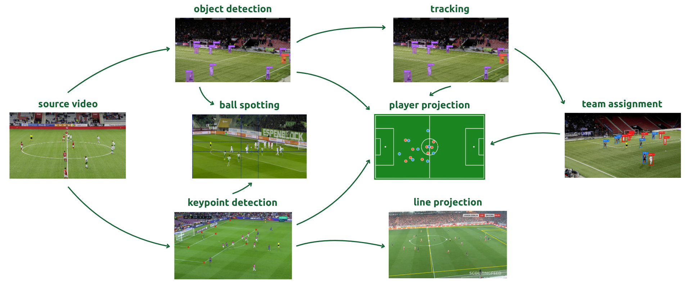
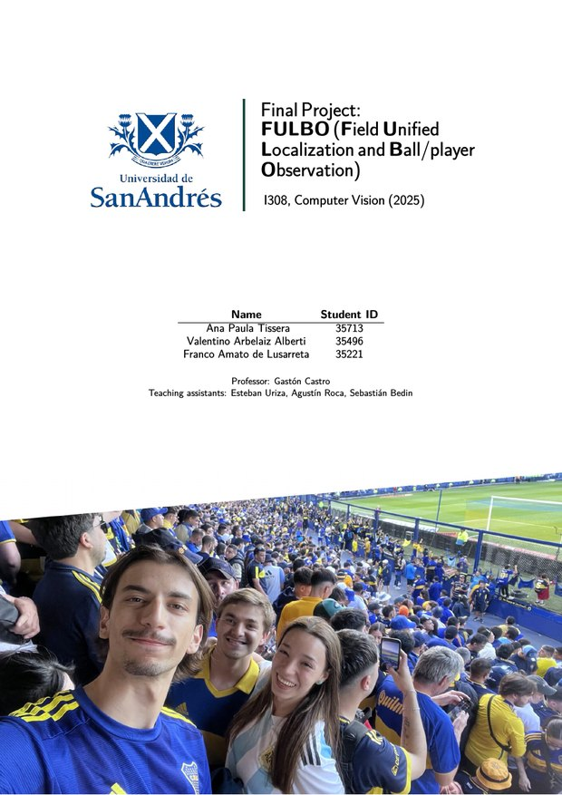
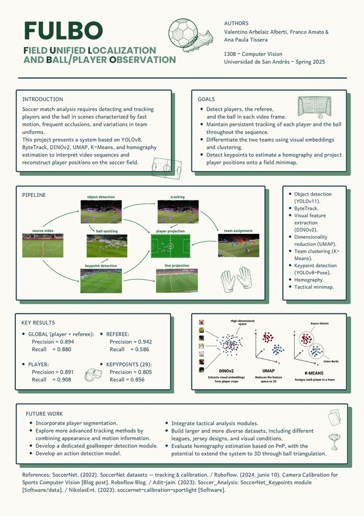

<div align="center">

# FULBO

**F**ield **U**nified **L**ocalization and **B**all/player **O**bservation

Football match analysis on [SoccerNet](https://www.soccer-net.org/). FULBO detects
players, referees and the ball, tracks them across a clip, assigns each player to
a team, estimates the geometry of the pitch and projects everything onto a
tactical minimap.

[](https://www.python.org/)
[](https://docs.astral.sh/uv/)
[](https://github.com/ultralytics/ultralytics)
[](LICENSE)

**[Paper](report/FULBO-paper.pdf)** &nbsp;·&nbsp;
**[Poster](report/FULBO-poster.pdf)** &nbsp;·&nbsp;
**[Result videos](https://drive.google.com/drive/folders/1cSUryrantwicC1TyZFKGAUPfLPuZal9v?usp=sharing)**

</div>



## How it works

Everything runs off two YOLO families trained on SoccerNet: detectors for the
people and the ball, and pose estimators for the pitch keypoints.

1. **Object detection.** A YOLO11m baseline finds players and referees. The ball
   is too small for it, so a dedicated fine-tune runs over 2x2 overlapping
   patches and its detections are merged back with non-maximum suppression.
2. **Tracking.** ByteTrack associates detections across frames and keeps a stable
   identity per person through partial occlusions.
3. **Team assignment.** DINOv2 embeds every player crop, the embeddings are
   averaged per track id, UMAP reduces them to 3D and K-Means splits them into
   two teams. One label per track, so the colour never flickers frame to frame.
4. **Pitch keypoints.** A YOLO pose model predicts the pitch landmarks, either
   29 or 57 of them, both derived from the SoccerNet line annotations.
5. **Homography and projection.** The keypoints are matched to a regulation
   105 m x 68 m pitch and a homography is fitted with RANSAC, which maps every
   detection onto the tactical minimap.

The two passes live in [`main.py`](main.py): pass 1 runs detection, tracking and
embedding collection; pass 2 fits the team clusters, computes the homography per
frame and renders the output.

## Repository layout

| Path | Contents |
|------|----------|
| [`main.py`](main.py) | Entry point that runs the full pipeline over a video, an image sequence or a single image. |
| [`src/data_prep/`](src/data_prep/) | Turns raw SoccerNet calibration annotations into YOLO pose datasets (29 and 57 keypoints). |
| [`src/train/`](src/train/) | Training scripts for the keypoint models and the detection models. |
| [`src/inference/`](src/inference/) | Keypoint detection, homography, tracking and minimap rendering. |
| [`src/evaluation/`](src/evaluation/) | Evaluation scripts and stored metrics for keypoints and tracking. |
| [`report/`](report/) | The written report and the poster, plus the LaTeX source of the paper. |
| [`models/`](models/) | Training curves and metrics for every run that was kept. |
| [`data/`](data/) | Where the datasets live once downloaded and prepared. Only the READMEs are tracked. |
| `outputs/` | Generated videos and figures. |
| [`pyproject.toml`](pyproject.toml), `uv.lock` | Environment and dependency definitions. |

Trained weights (`*.pt`) and the datasets are not tracked in the repository, as
they are too large. See [`data/README.md`](data/README.md) for how to regenerate
the datasets, and
[`outputs/link_to_videos.txt`](outputs/link_to_videos.txt) for the rendered
result videos.

## Setup

The project uses [uv](https://docs.astral.sh/uv/) and targets Python 3.12.

```bash
uv sync
```

Segment Anything 2 is optional and only needed for the segmentation notebook:

```bash
uv pip install -q git+https://github.com/facebookresearch/segment-anything-2.git
wget -q https://dl.fbaipublicfiles.com/segment_anything_2/072824/sam2_hiera_large.pt
```

## Usage

Prepare the keypoint datasets (downloads the SoccerNet calibration data first):

```bash
bash src/data_prep/run_dataload.sh
```

Train a keypoint model:

```bash
python -m src.train.keypoints.main --action train --epochs 50
```

Train the detection baseline and the ball detector:

```bash
python -m src.train.tracking.baseline_train
python -m src.train.tracking.ball.fine_tuning
```

Run the full pipeline (edit the configuration block at the top of `main.py` to
choose the source and the keypoint model):

```bash
python main.py
```

Evaluate:

```bash
python -m src.evaluation.keypoints.execute_evaluation
python -m src.evaluation.tracking.eval
```

## Results

Detection, on the SoccerNet tracking data:

| Run | Model | box mAP50 | box mAP50-95 |
|-----|-------|-----------|--------------|
| `detect/train` | YOLO11m baseline | 0.431 | 0.245 |
| `detect/train2` | baseline, retrained | 0.473 | 0.269 |
| `detect/train3` | baseline, best run | **0.704** | **0.419** |
| `detect/train4` | baseline, longer run | 0.573 | 0.347 |
| `ball` | ball-only fine-tune | 0.587 | 0.244 |

`detect/train3` is the detector the pipeline uses. The ball is detected by the
dedicated `ball` model with sliced inference, which recovers the small objects
the baseline misses.

Keypoints, on the SoccerNet calibration test split:

| Model | pose mAP50 | pose mAP50-95 | median RMSE | visibility P / R |
|-------|-----------|---------------|-------------|------------------|
| 29 keypoints | **0.735** | **0.622** | **59.9 px** | 0.805 / 0.856 |
| 57 keypoints | 0.599 | 0.465 | 74.4 px | 0.779 / 0.803 |

The extended 57-point layout was expected to give a better-conditioned
homography, since it adds the centre circle tangents and the penalty arcs. It
did not: every metric came out worse than the 29-point model, most likely
because the same amount of training data has to cover almost twice as many
points. The pipeline therefore defaults to the 29-point model
(`USE_57_POINTS = False` in `main.py`), and the 57-point path is kept because it
is a real result worth reporting.

Per-keypoint RMSE, per-frame errors and confidences are stored under
[`src/evaluation/keypoints/evaluation_outputs/`](src/evaluation/keypoints/evaluation_outputs/).

## Report

The full write-up, in English. Both documents are in [`report/`](report/), along
with the LaTeX source of the paper.

| [Paper](report/FULBO-paper.pdf) | [Poster](report/FULBO-poster.pdf) |
|:---:|:---:|
| [](report/FULBO-paper.pdf) | [](report/FULBO-poster.pdf) |
| Method, experiments and analysis in full. | One-page summary of the pipeline and the headline numbers. |

## Dead ends

Three things we tried that did not work out. The branches are still up.

| Branch | What it was | Why it went |
|---|---|---|
| [`experiment/hrnet-calibration`](https://github.com/varbelaiz/fulbo/tree/experiment/hrnet-calibration) | HRNetV2 from the SoccerNet calibration challenge: predict line heatmaps, fit the camera off them. | Never gave a stable enough homography. |
| [`experiment/yolo-pose-homography`](https://github.com/varbelaiz/fulbo/tree/experiment/yolo-pose-homography) | First YOLO pose attempt, on Roboflow's `sports` with a 32-point pitch. | Replaced by the 29 and 57 point pipelines on `main`. |
| [`experiment/ball-action-spotting`](https://github.com/varbelaiz/fulbo/tree/experiment/ball-action-spotting) | Action spotting with T-DEED on SoccerNet Ball Action Spotting. | Another task entirely. Cut to keep the scope. |

## Data sources and credits

- Data: [SoccerNet](https://www.soccer-net.org/) calibration and tracking splits.
- The 29-keypoint pipeline is adapted from
  [Adit-jain/Soccer_Analysis](https://github.com/Adit-jain/Soccer_Analysis).
- The 57-keypoint geometry is adapted from
  [NikolasEnt/soccernet-calibration-sportlight](https://github.com/NikolasEnt/soccernet-calibration-sportlight).
- Pitch rendering and configuration come from
  [roboflow/sports](https://github.com/roboflow/sports).

## License

[AGPL-3.0](LICENSE), inherited from Ultralytics YOLO, which the whole pipeline
runs on. [`NOTICE.md`](NOTICE.md) lists the third-party terms, including two
upstream sources that ship no license of their own and are used here with
attribution only.

## Authors

Coursework for I308, Computer Vision, Universidad de San Andres, 2025.

[Valentino Arbelaiz](https://github.com/varbelaiz),
[Franco Amato de Lusarreta](https://github.com/famatodlr) and
[Ana Paula Tissera](https://github.com/anatissera).
